(build_plate)=
# Magnetic Build Plate Assembly

## Video
_Video editing in progress!_

## Build Plate Assembly
[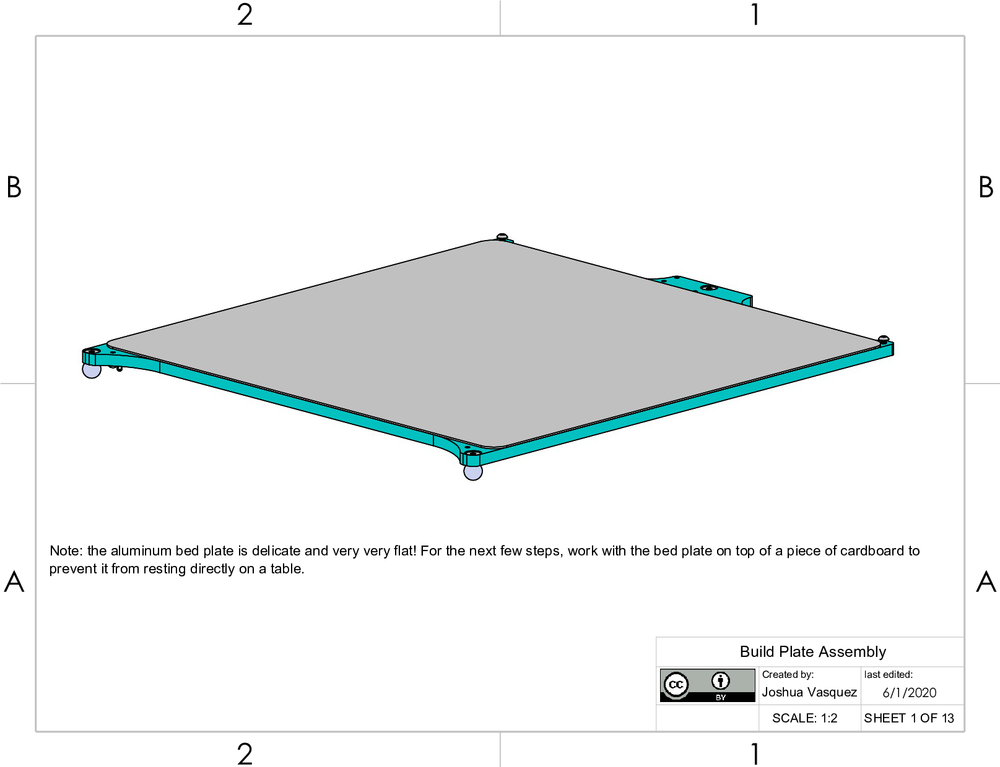](_static/build_plate0.png)

## Magnetic Sheet Application
[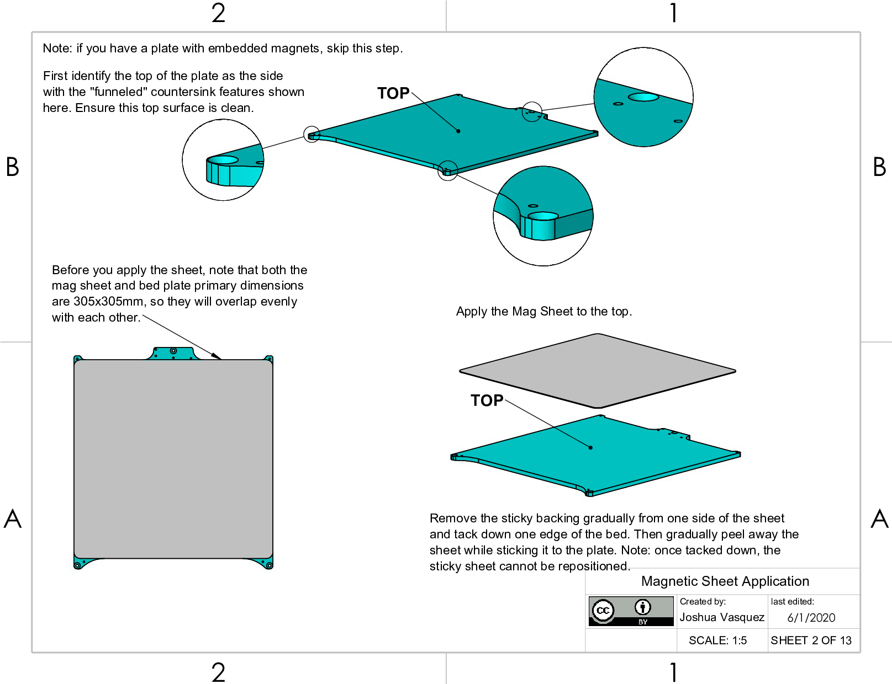](_static/build_plate1.png)

## Grounding Wire Fabrication
[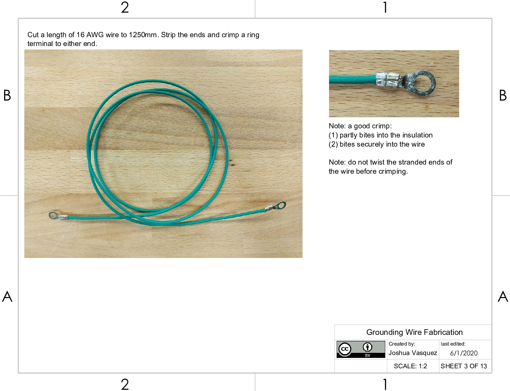](_static/build_plate2.png)

## Kinematic Ball Installation
[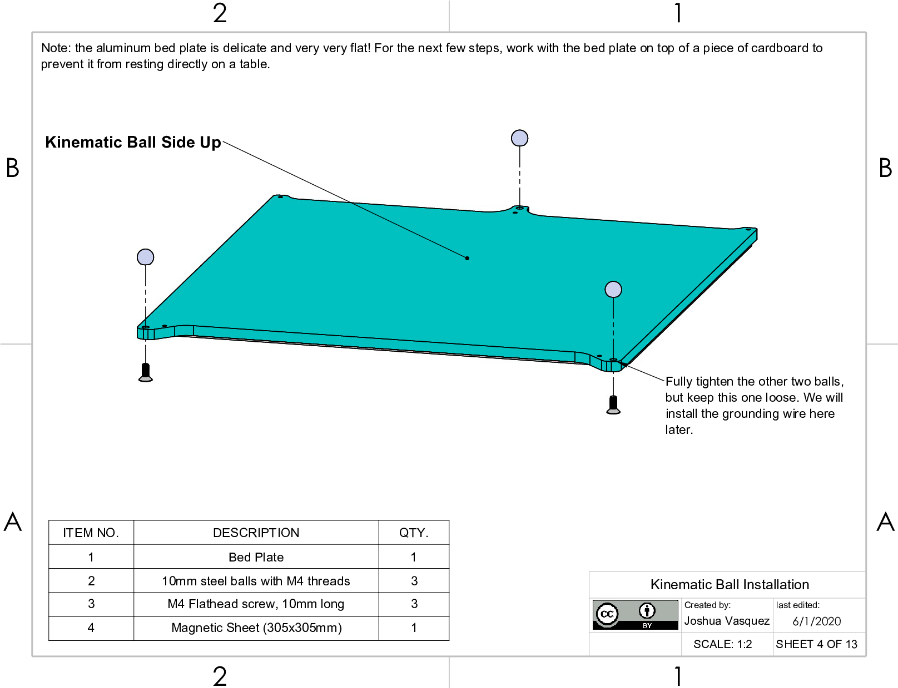](_static/build_plate3.png)

## Bed Retaining Screw Installation
[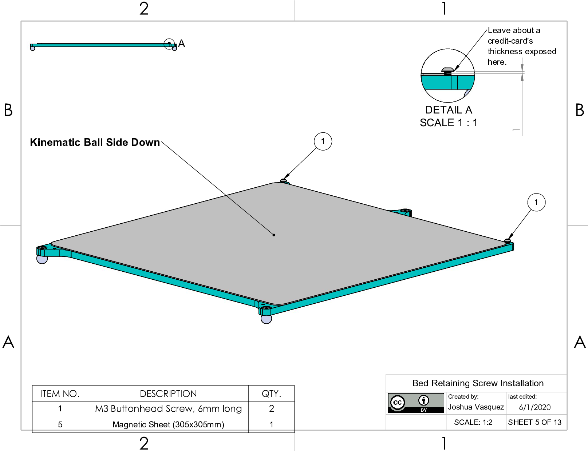](_static/build_plate4.png)

## Thermistor Wiring
[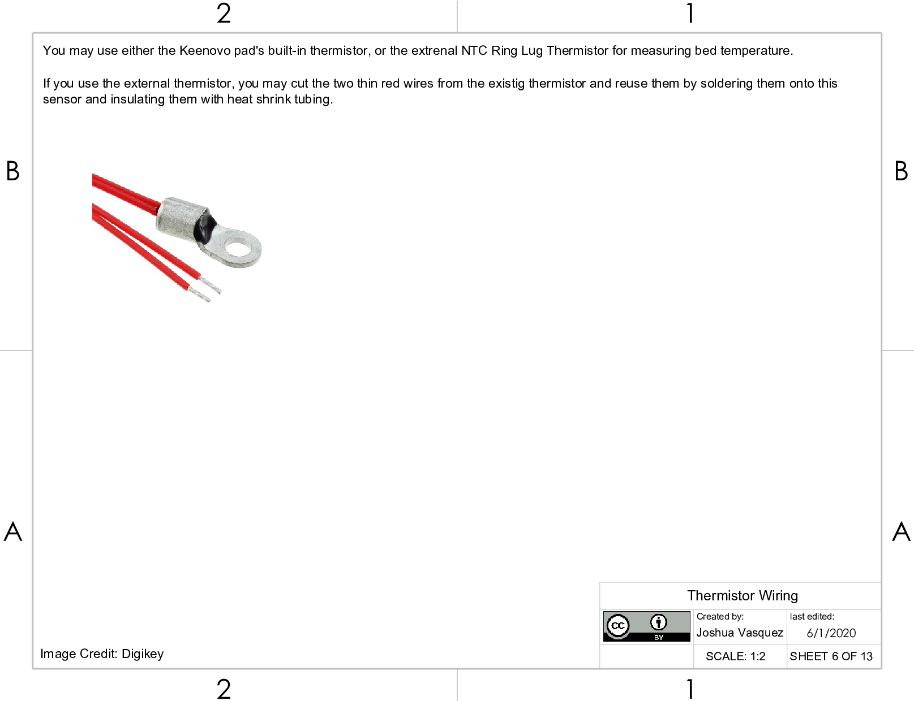](_static/build_plate5.png)

## Spring Anchor Creation 1/2
[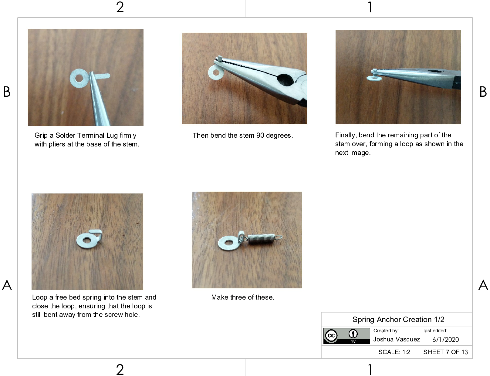](_static/build_plate6.png)

## Spring Anchor Creation 2/2
[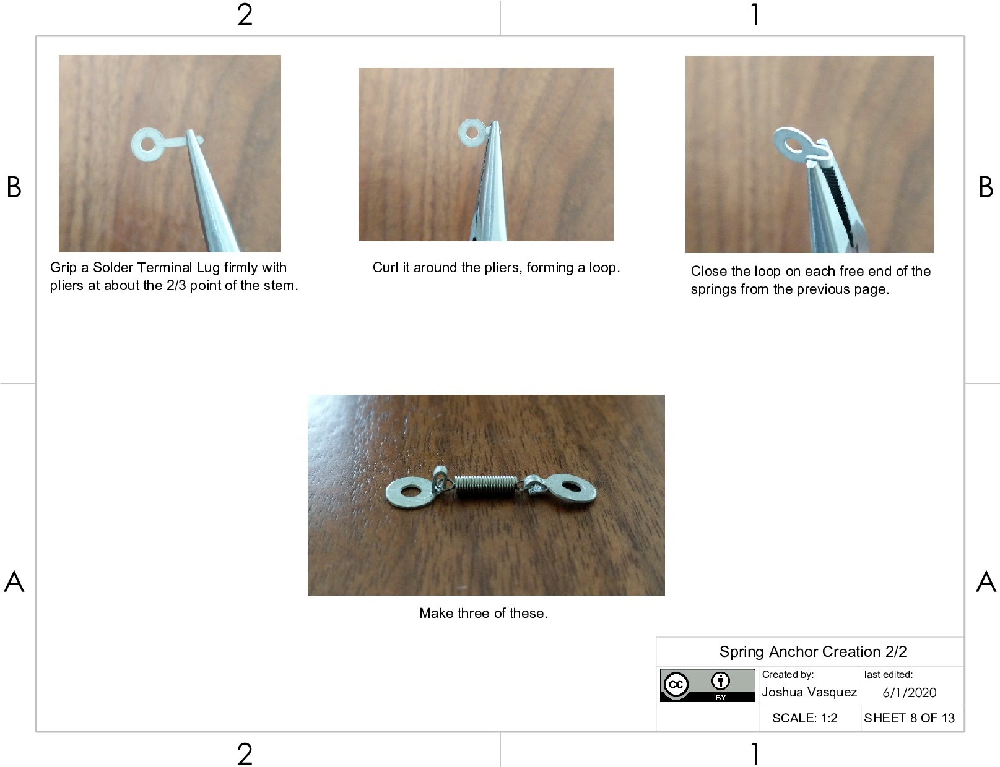](_static/build_plate7.png)

## Spring Anchor Installation
[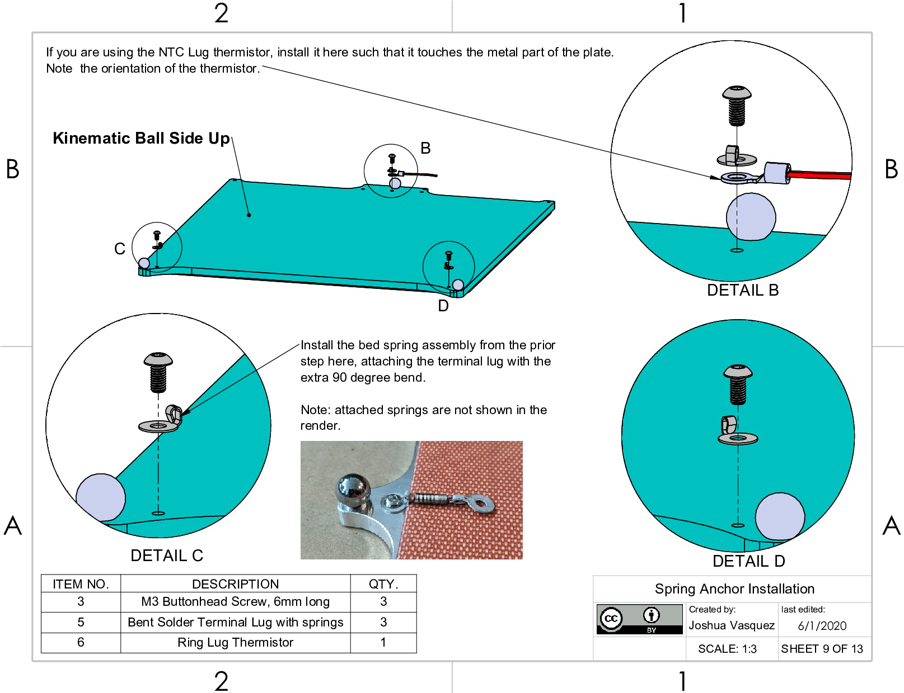](_static/build_plate8.png)

## Heated Pad Wire Management 1/2
[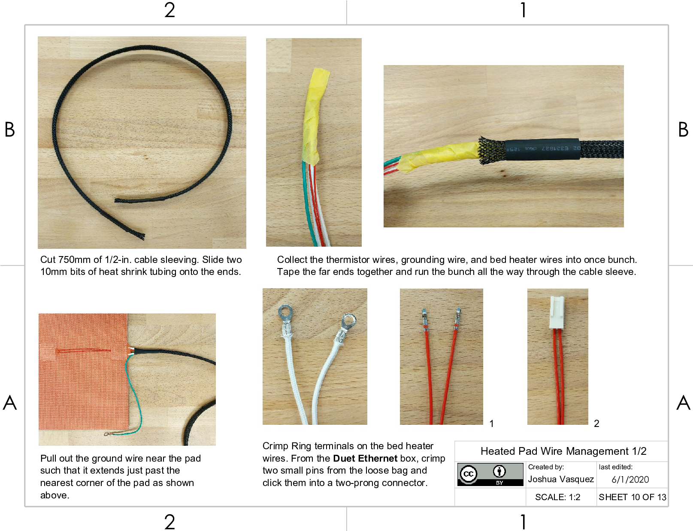](_static/build_plate9.png)

## Heated Pad Wire Management 2/2
[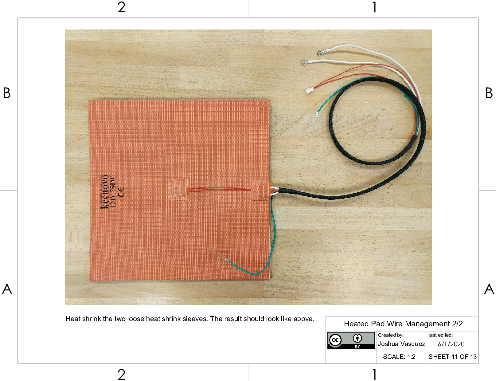](_static/build_plate10.png)

## Heated Pad Installation
[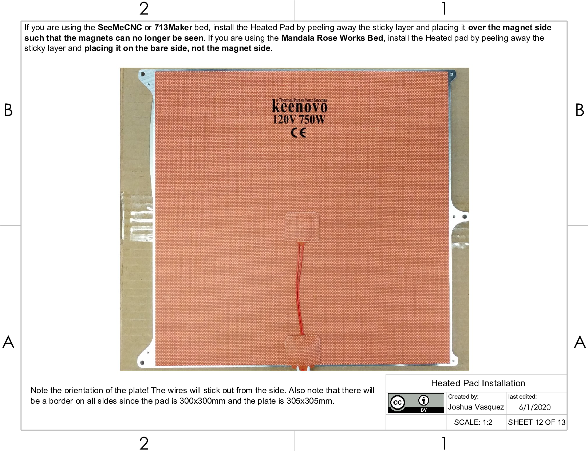](_static/build_plate11.png)

## Grounding Wire Installation
[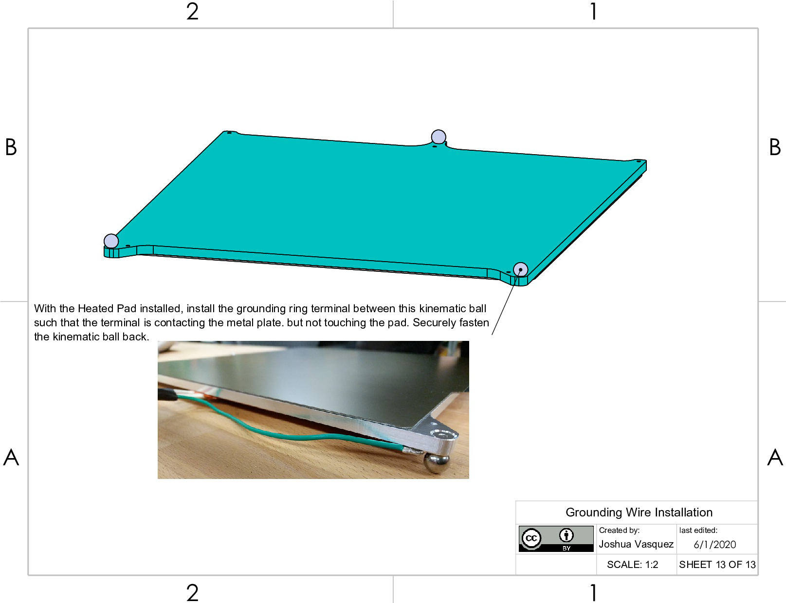](_static/build_plate12.png)
