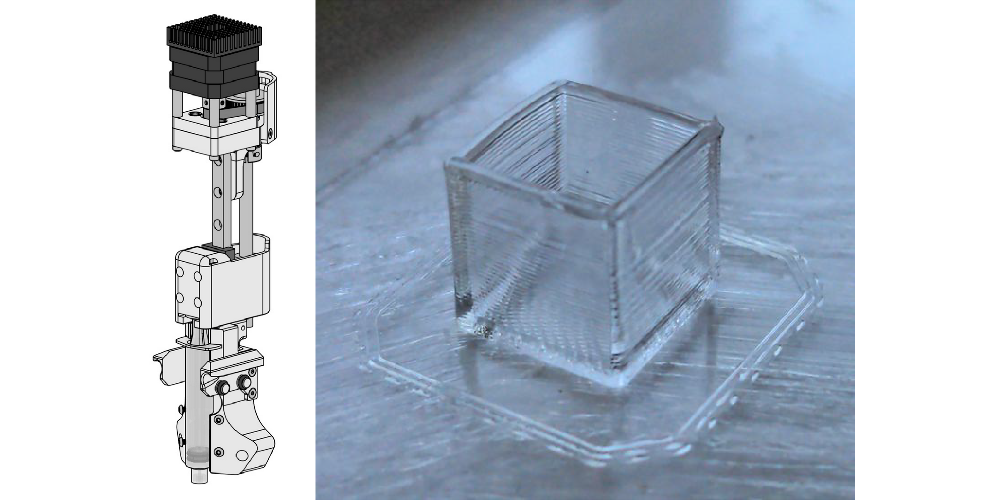
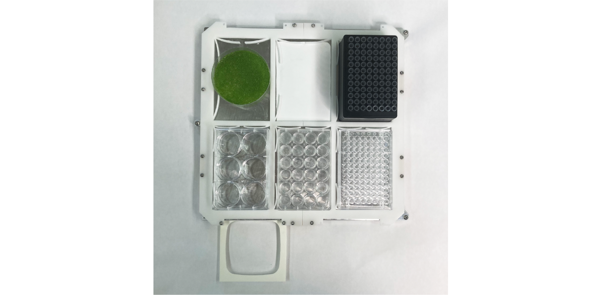

(building-science-jubilee-tools)=
# Building Science Jubilee Tools

All tools which are supported in `science-jubilee` are documented here. For existing tools, we link to documentation on the Jubilee project page and provide additional information where necessary. Here, we describe tool prerequisites, the current gallery of tools, how to design a custom tool, and how to calibrate a tool.

(tool-prerequisites)=
## Tool Prerequisites

<!-- Most any Jubilee tool will require a few parts, like a parking post and cable management. If you're new to making Jubilee tools, this page provides some background information.

[Tool Prereqs](tool_prereqs) -->

### Parking Post

Jubilee tools are parked on the rear rail of the machine. To hold the tool when it's not in use, any tool will need a parking post. Several sizes already exist to accommodate tools of varying widths.

```{figure} _static/parking-post.png
:scale: 50 %

Diagram of a Jubilee parking post.
```

### Tool Wings

Each tool needs a way to rest on top of the pins of the parking post above. While this is sometimes accomplished in different ways depending on the tool design, a common way is to use tool 'wings', which slide into the parking post pins.

```{figure} _static/tool-wing.png
:scale: 20 %

Jubilee tool wing
```

See the video below to get an idea of how the tool wing works:

<iframe width="354.375" height="630"
src="https://www.youtube.com/embed/F8c2MbFglJU?mute=1"
title="First tool loaded"
frameborder="0"
allow="accelerometer; autoplay; clipboard-write; encrypted-media; gyroscope; picture-in-picture; web-share"
allowfullscreen></iframe>

### Tool Plate

Each tool has a tool plate which couples with Jubilee's toolchanger to be able to be picked up. This tool plate can be 3D printed + laser cut, or you can purchase aluminum toolplates (e.g., [Luke's Laboratory fully assembled tool plate](https://lukeslabonline.com/products/jubilee-tool-plate?variant=41427956859065)).

```{figure} _static/tools.png
:scale: 15 %

Shown are a set of tools parked on a Jubilee; seen on the side of each tool frame are a set of tool wings resting on an accompanying parking post. The tool plates of each tool are visible; note the three threaded steel balls on each which will couple with toolchanger on pickup, and the white wedge plate (made of delrin) in the center.
```

### Fabricating a Tool

To fabricate any tool, you'll need access to:

- a 3D printer, to print parking posts, tool wings, and tool frames;
- a soldering iron, for heat-press inserts;
- a set of hex keys, to tighten up screws.

If you plan on making new tools regularly, it might also be useful to stock up on the following materials:

- Jubilee wedge plates, which can be purchased [here](https://www.filastruder.com/products/wedge-plate-for-jubilee?_pos=1&_sid=b2191c16a&_ss=r);
- M3 & M5 screws;
- M3 heat set inserts;
- O-rings (for use on the tool wings);
- Metal pins (for the parking post).

### Cable Management

Many tools have wires that control tool components like motors and cameras. To keep wires out of the way, you can use [large zip ties](https://www.amazon.com/Gardner-Bender-45-536UVBSP-Heavy-Duty-Electrical/dp/B000BOKN0C) which extend from the Jubilee electronics panel to the tool itself, and zip tie the cables to the large zip tie to hold the wires out of the way. There is also a 3D printable [cable management bracket](https://github.com/machineagency/jubilee/blob/main/tools/jubilee_tools/tools/extruders/direct_drive_bondtech_groovemount_extruder/fabrication_exports/tool_cable_management_bracket.STL) which can be attached to the back of the rear Jubilee rail to hold cables.

## Tool Gallery

### Pipette Tool


To use an OpenTrons Pipette with Jubilee

[Pipette Tool](pipette_tool)

### Inoculation Loop Tool


To hold inoculation loops, pens, or other probes.

[Inoculation Loop Tool](inoculation_tool)

### Top-Down Camera Tool


To hold a Raspberry Pi camera for imaging the deck.

[Camera Tool](top_down_camera_tool)

### Side Camera Tool


To hold a Raspberry Pi camera to image parallel to the deck.

[Side Camera Tool](side_camera_tool)

### Syringe Tool



To hold a 10cc or 50cc syringe.

[Syringe Tool](syringe_tool)

### Lab Automation Deck



Deck attachment to hold 6 standard microplates + disposal containers.

[Lab Automation Deck](lab_automation_deck)

## Designing Custom Tools

The shortcut to 3D modeling a tool with the right placements is to simply build on top of the CAD files in [the template folder](https://github.com/machineagency/jubilee/tree/main/tools/jubilee_tools/tool_template).

```{figure} _static/tool-template.png
:scale: 50 %

Tool template showing dimensions of wedge plate and tool balls (left), an assembled tool plate with tool wings (middle), and a complete USB microscope tool (right).
```
Starting from scratch is also straightforward. To create a custom tool that locks into Jubilee's carriage, you must place the tool balls and the wedge plate in a specific location, specified in the [Tool Template Reference Dimensions](https://github.com/machineagency/jubilee/raw/main/tools/jubilee_tools/tool_template/references/tool_template_reference_dimensions.pdf), copied below.

```{figure} _static/tool-template-reference-dims.png
:scale: 30 %

[Tool Template Reference Dimensions](https://github.com/machineagency/jubilee/raw/main/tools/jubilee_tools/tool_template/references/tool_template_reference_dimensions.pdf)
```

There are a few size constraints that may influence your tool's shape (see below). A number of example tools are shown in the [Tool Interface Diagram PDF](https://github.com/machineagency/jubilee/raw/main/frame/references/tool_interface_diagram.pdf). Note that many of these constraints are soft. Using longer dowel pins on the parking post will allow for deeper tools. Also, moving the tool's active center past the leftmost line will result in a working tool that simply has a bit less Y-axis travel.

```{figure} _static/tool-interference-diagram.png
:scale: 50 %

Tool interference and constraints diagram
```

## Tool Postrequisites

Once you've built a tool, it needs to be calibrated for use on the machine. See here for guides and help on the tool calibration process.

[Tool Postreqs](tool_postreqs)

```{toctree}
:hidden:

pipette_tool
inoculation_tool
top_down_camera_tool
side_camera_tool
syringe_tool
lab_automation_deck
designing_custom_tools
tool_postreqs
```

## Additional Resources

- [https://jubilee3d.com Tool info](https://jubilee3d.com/index.php?title=Tools)
- [https://jubilee3d.com Parking Post info](https://jubilee3d.com/index.php?title=Parking_Post)
