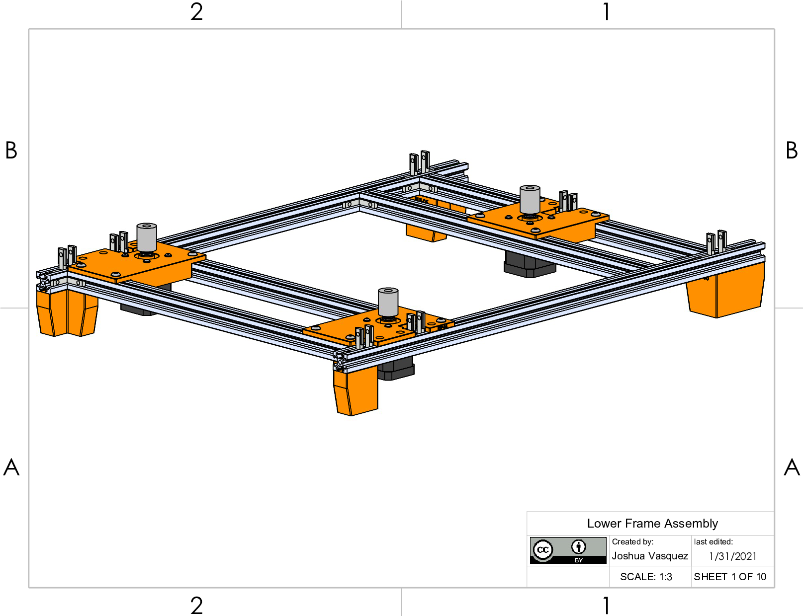
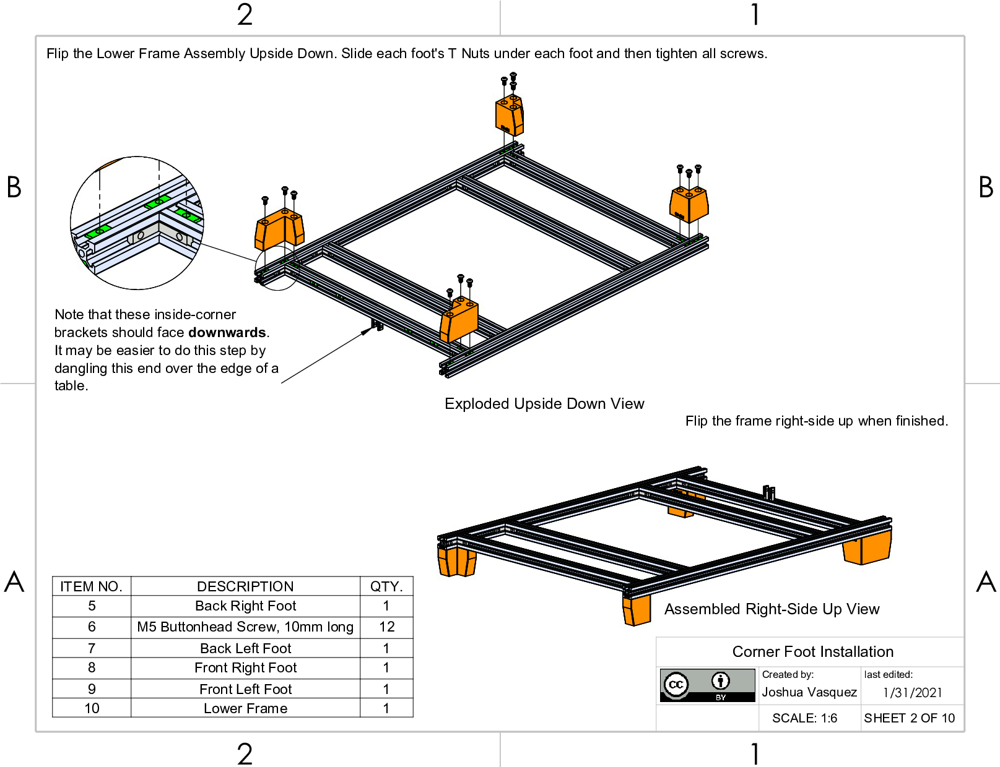
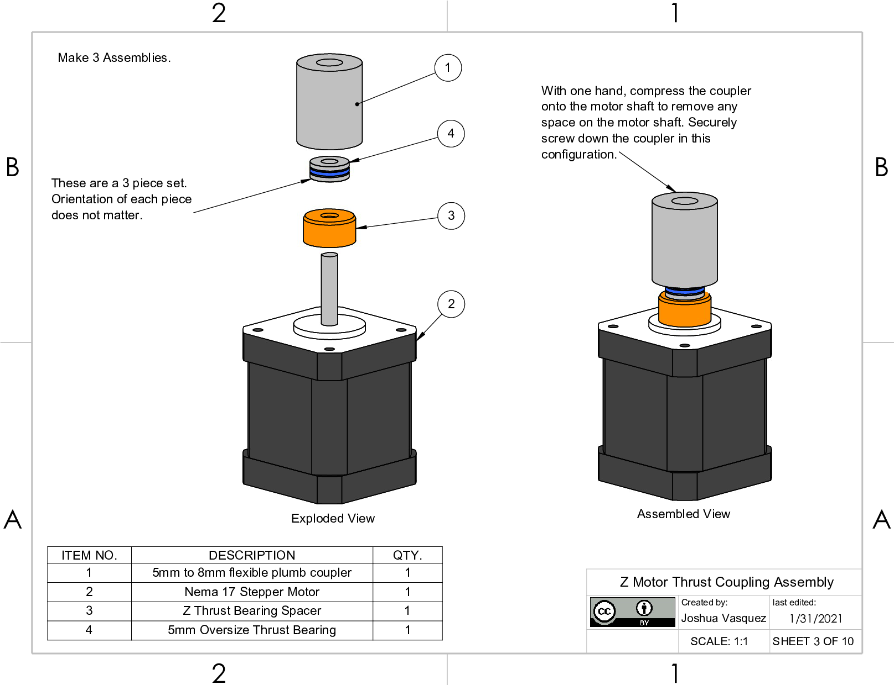
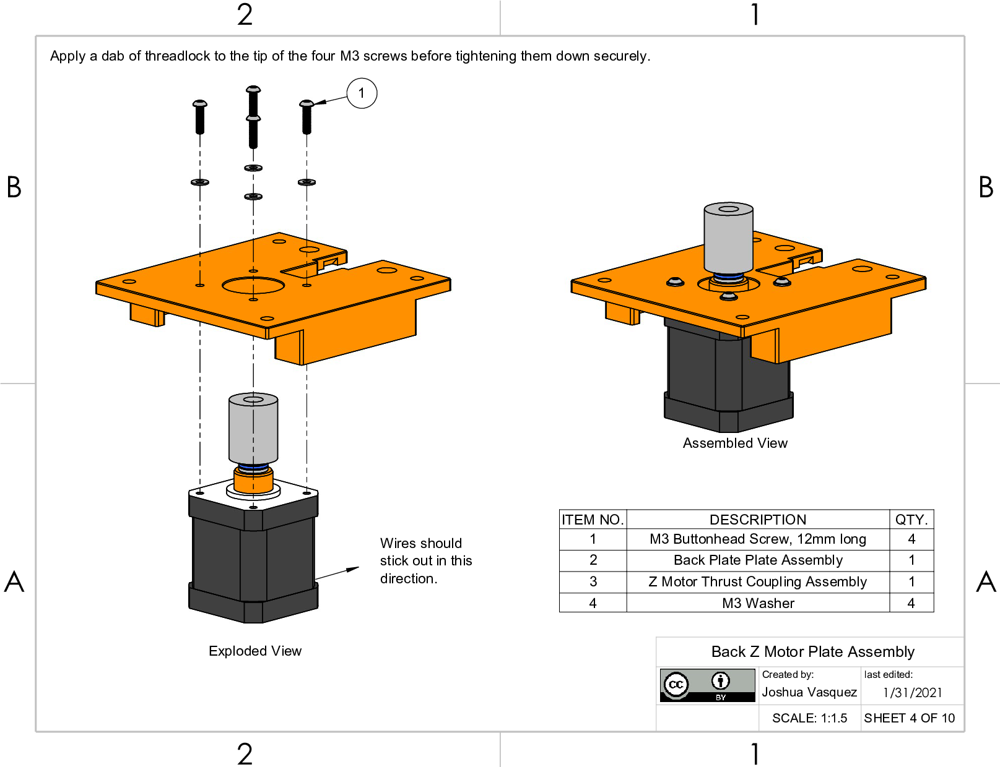
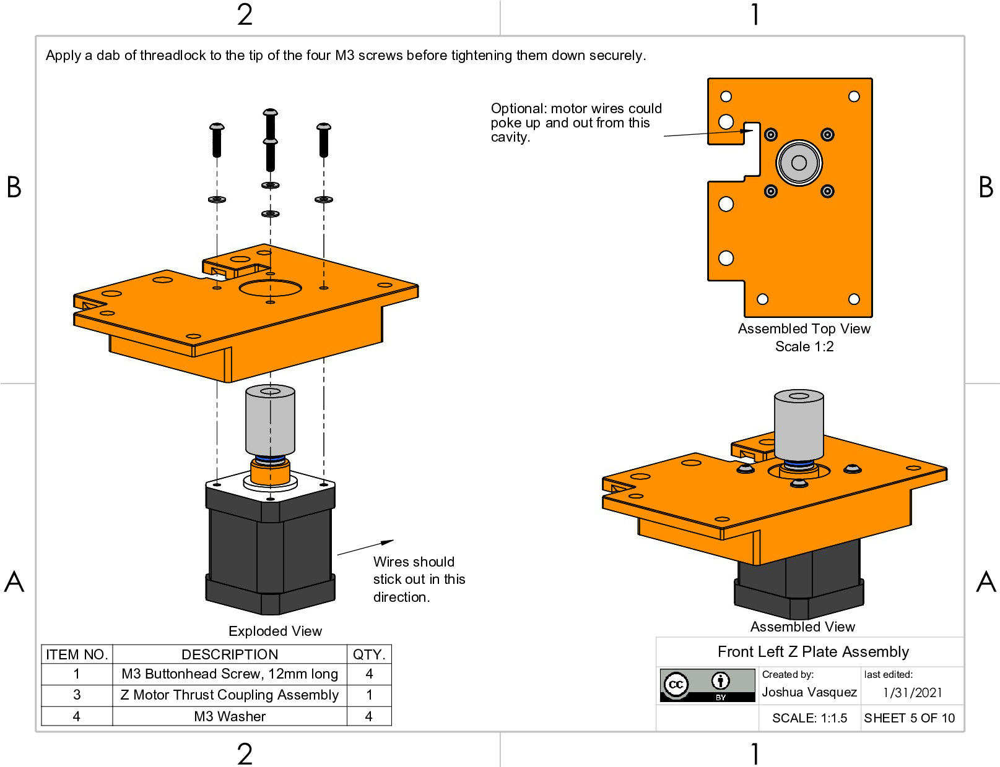
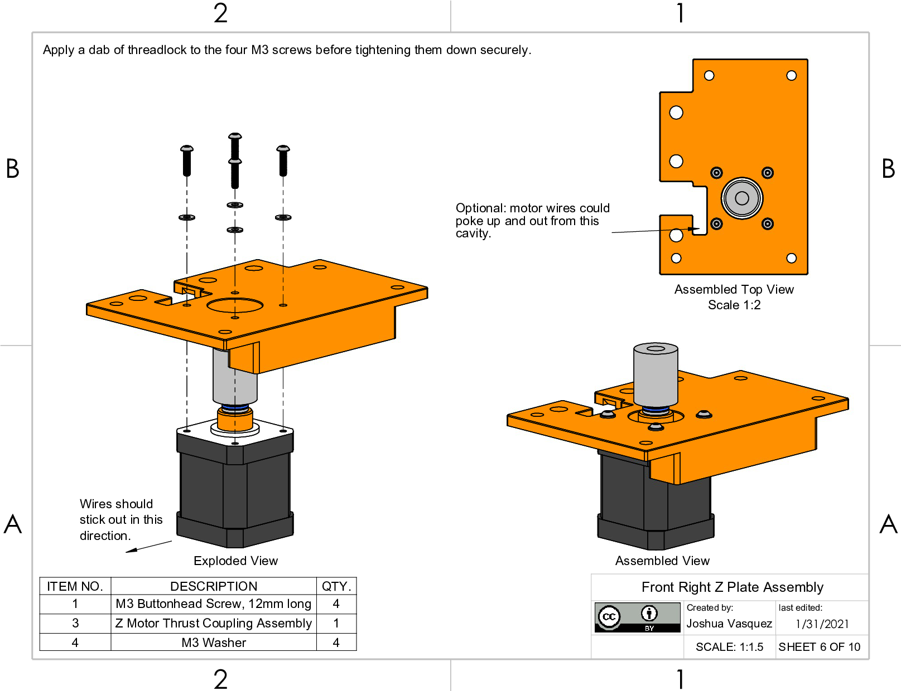
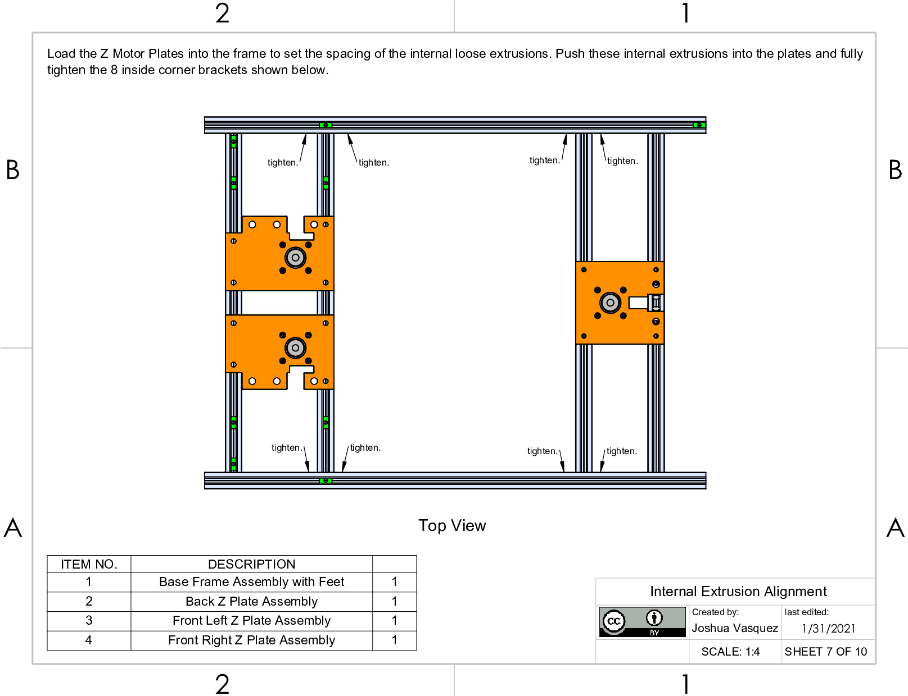
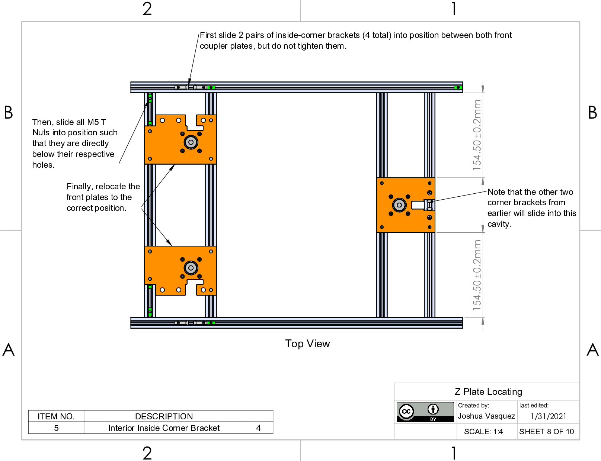
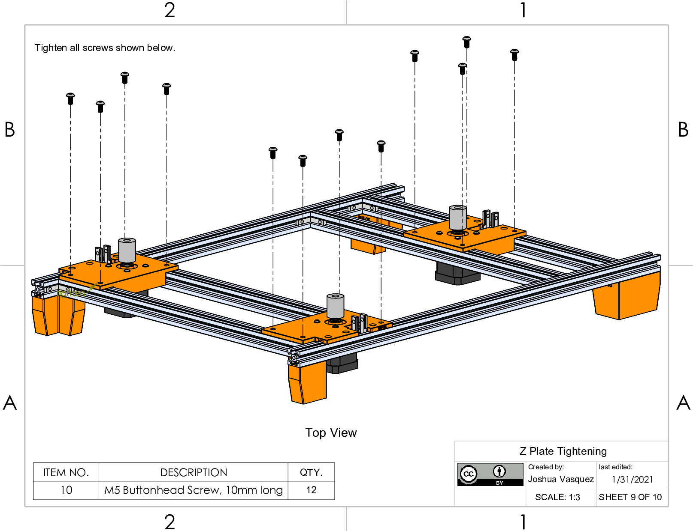
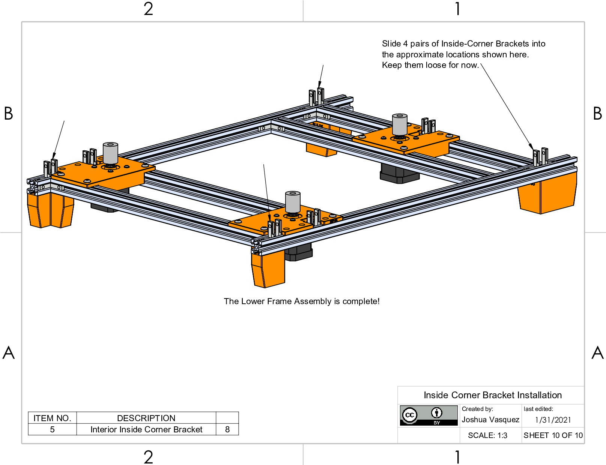

(lower-frame)=
# Lower Frame Assembly

## Video
_Video editing in progress!_

## Lower Frame Assembly

## Corner Foot Installation

## Z Motor Thrust Coupling Assembly

## Back Z Motor Plate Assembly

## Front Left Z Plate Assembly

## Front Right Z Plate Assembly

## Internal Extrusion Alignment

## Z Plate Locating

## Z Plate Tightening

## Inside Corner Bracket Installation

