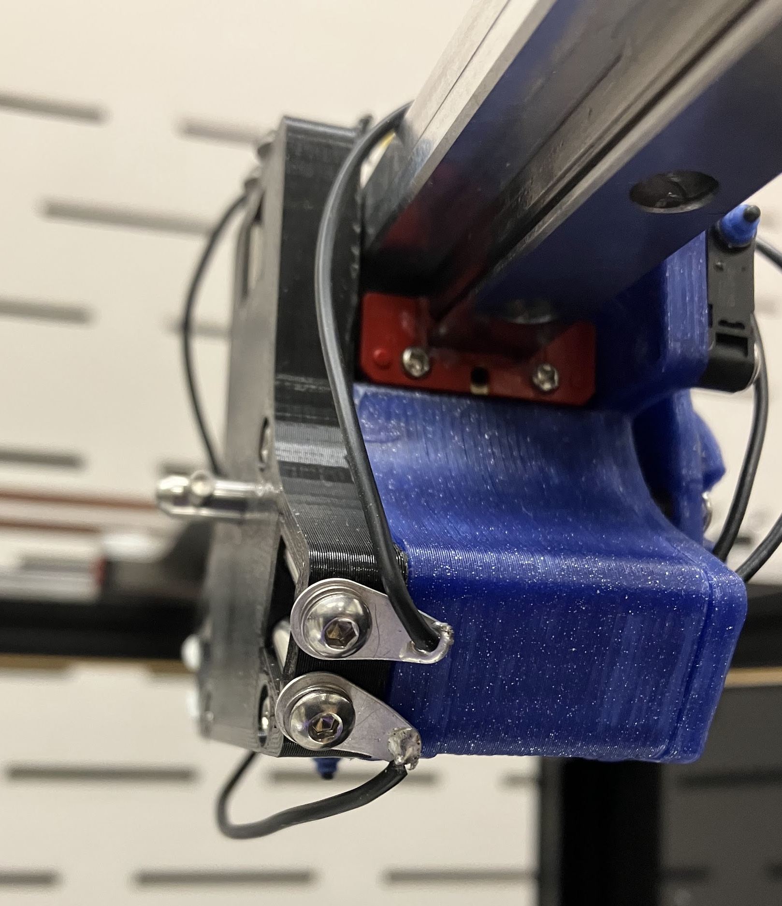
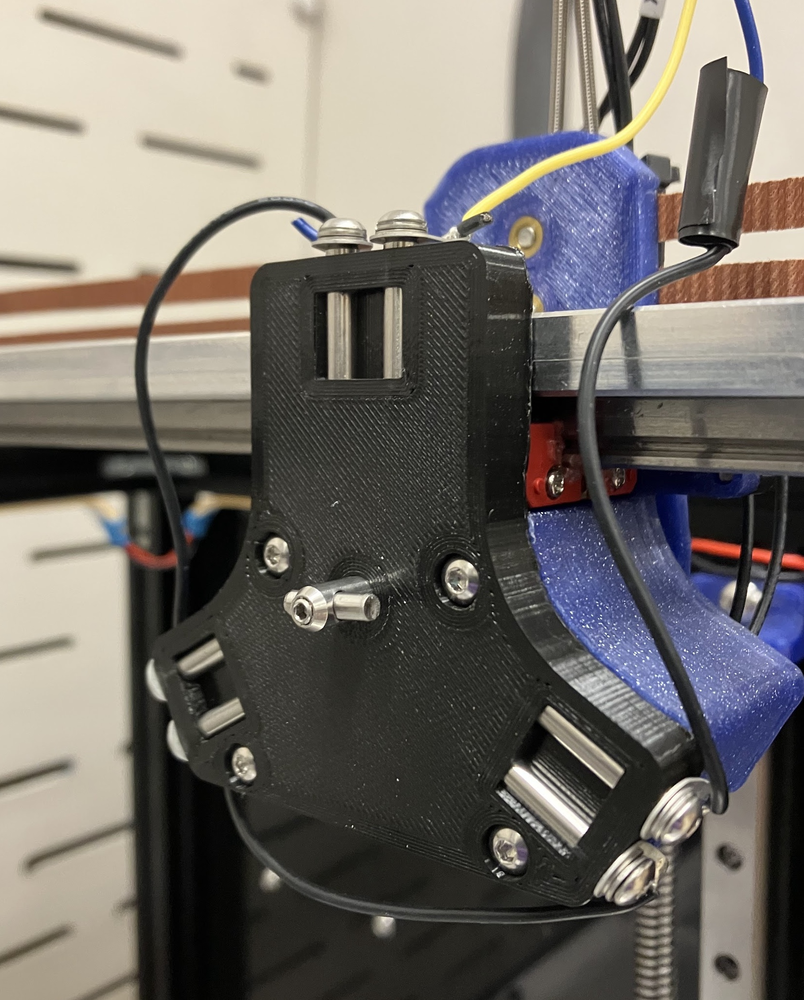

(crash - detection)=
# Science Jubilee Tool Crash Detection

A Jubilee crash is an unwanted collision between the current tool or toolchanger carriage and the bed plate or labware on the deck. You will (almost certainly) crash your Jubilee. This can happen when you click the wrong button in the duet web control interface while aligning samples, forget to remove labware from the deck before homing or improperly align your labware, to name a few examples. Depending on the context in which it occurs, a crash can range from a minor annoyance requiring a machine re-start, through an expensive mistake causing thousands of dollars of damage, up to a serious safety incident involving spilled chemicals or crush injuries. When using Jubilee in a scientific setting, crash detection is highly desireable. We see three theoretically possible options for detecting crashes: 1) tool ball contact sensor trigger, 2) stepper motor stall guard, and 3) computer vision based incident detection. We have implemented  option 1 and reccomend new Jubile users do as as well. The other two are described here for completeness, but we have not gotten them working. 

## Tool ball contact sensor crash detection


```{youtube} IgjtlrmePy0
```

This approach uses the contact between the tool balls and the kinematic coupling pins as a switch. The idea is that meaningful force applied to the tool will twist at least one of the tool balls out of it's seat with the tool changer pins. This will break the circuit and trip a trigger set up in the Duet firmware. We are in the early phases of testing this solution. So far, it provides reliable crash detection for collisions in the X, Y, and Z directions. There is a possibility for false positives, which seems to be reduced by increasing the torque on the tool changer locking pin. Implementing this requires electrically connecting the toolchanger interface dowel pins and modifying your machine configuration. We have not tested this implementation with the pipette tool or other tools that need to exert force on the deck to operate. 

### Implementing tool ball contact sensor

```{warning}
This feature is in early development. You may run into unexpected issues. 
```

#### Parts required:
1. Jubilee [carriage coupler plate ](https://github.com/machineagency/jubilee/blob/main/frame/fabrication_exports/3d_printed_parts/toolchanger/toolchange_carriage/carriage_coupler_plate.STL) printed part. Follow the main [Jubilee printing instructions.](https://jubilee3d.com/index.php?title=3D_Printed_Parts#Default_Print_Settings)
2. Threaded dowel pins, M3x4mmx20mm. You need 6 of these per Jubilee We use [these ones](https://www.aliexpress.us/item/3256805293246699.html).
3. M3x4mm buttonhead screws, quantity 6
4. [M3 solder lug](https://www.digikey.com/en/products/detail/keystone-electronics/7328/316697?s=N4IgTCBcDaIMwDYC0B2OYAcSByAREAugL5A), quantity 6. These are the same part used in the toolchanger REL mechanism so you might have some spares. 
5. Hookup wire, 22 or 24 gauge
6. Contacts and housing for 5-pin molex connector (for Duet IO ports)


#### Tools required:
1. Arbor press or other means of inserting dowel pins
2. [Tool carriage pin insertion fixture](https://github.com/machineagency/jubilee/blob/main/tools/assembly_fixtures/coupling_plate_pin_insertion_fixture.STL) (print)
3. Soldering station (soldering iron, solder, etc)
4. Wire crimping tool (ex [Engineer PA-09](https://www.amazon.com/ENGINEER-AWG32-AWG20-Connectors-Oil-Resistant-PA-09/dp/B002AVVO7K?th=1))
5. Wire strippers
6. Assorted hex drivers 


#### Assembly Instructions

1. Perform some quality control on you dowel pins. Make sure your M3 screws thread in nicely. 
2. [Press the dowel pins into the carriage coupler plate](./toolchanger_carriage.md#coupling-plate-assembly). Make sure the threaded end of the dowel pin is facing out!
3. Screw the solder lugs into the dowel pins with the M3 screws. Align the tabs facing 'backwards', away from the dowel pin side of the carriage plate.
4. Solder the lugs together, using the pattern shown. Use lengths of wire that are as short as possible for the inter-lug connections. Right now the wires just float loosely. Somebody should modify the carriage plate so the wires can be neatly recessed. That could be you!


Wired lugs will look like this:



| From | To |
|---| ---|
|Duet board | Pin 1|
| Pin 2 | Pin 3 |
|Pin 4 | Pin 5|
Pin 6 | Duet board |

5. Terminate the duet end of the wiring with molex terminals. Place the terminals in the 2 and 3 positions of the housing. 
6. [Install the carriage plate on your toolchanger carriage.](./corexy.md#front-carriage-assembly). Your installed plate will look something like this.



7. Route the duet wires along the rest of the toolchanger wiring bundle back to your duet board
8. Plug the connector into an open IO port. We use io_3 in these instructions but any will do. 


#### Configuration instructions

We will be configuring the tool ball switch as a Duet trigger. With a trigger activated, your duet will watch for a change in state on an external switch. When a change is detected, the defined action will be run. Here we will be using the trigger as an emergency stop. This will disable the steppers immediately and reset the board, the same as running the [M112 gcode](https://docs.duet3d.com/User_manual/Reference/Gcodes#m112-emergency-stop). You can read more on duet triggers [here](https://docs.duet3d.com/User_manual/Tuning/Triggers). We want our trigger to be active while a tool is in use, but we need to de-activate it whenever we park a tool, otherwise our machine will shut off when we do so. To accomplish this, we will define triggers in every tool pick-up macro and disable them before the tool is parked. 

1. Add this line to your `sys/config.g` file. This will define your tool ball switch on the input that you are using. Change the input number to the connector that you plugged your wiring into. 

```
M950 J0 C"^0.io3.in" ;define input 0 (J0) on connector board 0, io3, in pin, with pullup
```
Steps 2 and 3 will need to be done for every tool you want the crash detection to be active for. 

2. Add the following lines to the end of the `tpost{n}.g` file of the tool you want to activate. Read more on the `M581` trigger gcode and it's parameters [here](https://docs.duet3d.com/User_manual/Reference/Gcodes#m581-configure-external-trigger)

```
M400; clears buffer of moves before proceeding.
M117 "initializing triggering on tool {n}" ; Debug print statement, remove if you want
M581 P0 T0 S1 R0 ; set up triggering
```

3. Add the following line to your `tfree{n}.g` file for your tool, immediately before the line that runs the tool_unlock.g macro. This will de-activate the trigger so the machine does not e-stop when you unlock the tool.

```
M581 P0 T0 S1 R-1 ; disable triggering
```

#### Testing crash detection

Gingerly test that the detection works with a tool that you don't care too much about. After picking up the tool, slowly push the bed up into the tip of the tool. At the first sign of deflection in the tool, the machine should disable steppers and reset. 

If you are having issues with false positives while moving the tool around the bed without crashing it, try re-running the tool-lock macro after the tool has been picked up. This will give an extra cinch on the tool locking pin, holding the tool on tighter. You can test this by clicking on the `tool_lock.g` macro in the duet web control interface, and implement it permanently by adding another tool_lock line to your tool pickup macro. This might cause some long-term reliability issues with the tool changer interface or motor. We are still testing this. Alternatively, you could decrease the maximum acceleration of the X and Y axes in the machine configuration.


#### Future enhancements
Currently, this implementation emergency stops the machine. Recovering from this is a major hassle, requiring parking tools, clearing the bed, re-homing the machine, and re-starting any experiments. The `M581` trigger command can be configured to run an arbitrary gcode macro instead of e-stopping. A macro could be set up to pause the machine and publish a 'crash detected' message to HTTP or MQTT clients using the `M118` command. Our science-jubilee python interface could be modified to gracefully interrupt running experiments and notify the user when a crash is detected, enabling smoother recovery. 

## StallGuard based crash detection


The Trinamic stepper motor drivers used in the Duet boards have stallGuard, a feature that allows the drivers to detect motor stalls. This would be ideal as it could allow for force-adjustable crash detection and could be always-on to detect issues when tools aren't active. However, the general consensus seems to be that stall detection is finicky and requires extensive tuning. We have looked into this option and could not figure out the Duet config to get it to work. Read more on it [here](https://docs.duet3d.com/User_manual/Connecting_hardware/Sensors_stall_detection).

## Computer vision based incident detection

Our third idea for incident detection is to use a computer vision system to monitor a video feed of Jubilee. The system could be trained on examples of correct operation and common incident scenarios. This would have the benefit of flagging non-crash incidents that could impact experiments, such as missed pipette tip pickups, but might struggle to detect edge-case crash incidents. We have not looked into options for implementing this. 