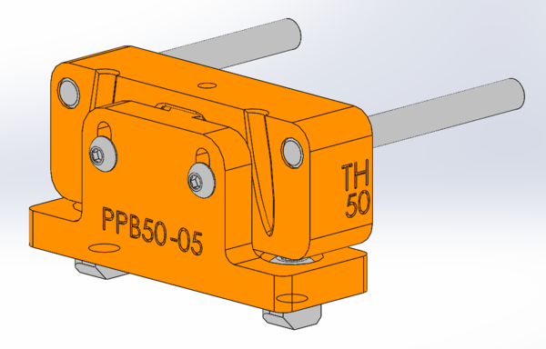

(tool-prerequisites)=
# Tool Prerequisites

## Anatomy of a Tool

### Parking Post

Jubilee tools are parked on the rear rail of the machine. To hold the tool when it's not in use, any tool will need a parking post. Several sizes already exist to accommodate tools of varying widths. More info [here](https://jubilee3d.com/index.php?title=Parking_Post).

```{figure}
{scale="50%"}

Diagram of a Jubilee parking post.
```

### Tool Wings

Each tool needs a way to rest on top of the pins of the parking post above. While this is sometimes accomplished in different ways depending on the tool design, a common way is to use tool 'wings', which slide into the parking post pins.

### Tool Plate

Each tool has a tool plate which couples with Jubilee's toolchanger to be able to be picked up. This tool plate can be 3D printed + laser cut, or you can purchase aluminum toolplates.

```{figure} _static/tools.png
:scale: 15 %

Shown are a set of tools parked on a Jubilee; seen on the side of each tool frame are a set of tool wings resting on an accompanying parking post. The tool plates of each tool are visible; note the three threaded steel balls on each which will couple with toolchanger on pickup, and the white wedge plate (made of delrin) in the center.
```

## Fabricating a Tool

To fabricate any tool, you'll need access to:

- a 3D printer, to print parking posts, tool wings, and tool frames;
- a soldering iron, for heat-press inserts;
- a set of hex keys, to tighten up screws.

If you plan on making new tools regularly, it might also be useful to stock up on the following materials:

- Jubilee wedge plates, which can be purchased [here](https://www.filastruder.com/products/wedge-plate-for-jubilee?_pos=1&_sid=b2191c16a&_ss=r);
- M3 & M5 screws;
- M3 heat set inserts;
- O-rings (for use on the tool wings);
- Metal pins (for the parking post).

## Cable Management

Many tools have wires that control tool components like motors and cameras. To keep wires out of the way, you can use [large zip ties](https://www.amazon.com/Gardner-Bender-45-536UVBSP-Heavy-Duty-Electrical/dp/B000BOKN0C) which extend from the Jubilee electronics panel to the tool itself, and zip tie the cables to the large zip tie to hold the wires out of the way. There is also a 3D printable [cable management bracket](https://github.com/machineagency/jubilee/blob/main/tools/jubilee_tools/tools/extruders/direct_drive_bondtech_groovemount_extruder/fabrication_exports/tool_cable_management_bracket.STL) which can be attached to the back of the rear Jubilee rail to hold cables.
