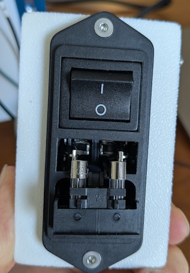

(default-wiring)=
# Default wiring guide

This is our recommended default wiring for new Jubilee builds. Start here unless you know you need something different.

**Not shown** -- attach the electronics back-panel assembly to your assembled frame, using fourteen M5 x 8mm to attach to the stamped T-nuts in the back of the frame. You may find it convenient to loosen or even remove the power switch. 

We assume that you are building the recommended Duet 3 Mini + 3 HC option.  [Instructions for other configurations can be found on the Jubilee3D website](https://jubilee3d.com/index.php?title=Assembly_Instructions#Electronics)

*Note:* A Science Jubilee builder who is not installing the heat bed can skip the instructions related to the Heated Bed and solid state relay.

*Note:* If your Filastruder kit came with a y-axis limit switch cable that is only 300 mm long (instead of the notional 450 mm), you can rotate the Duet 3 HC expansion board and get it to connect without straining the cable. 

*Note:* The following diagram swaps the `ZL` and `ZB` wire labels are swapped (the wiring and board positions are correct, only the labeling is wrong.)

It may be useful to consult the [wiring guide PDF](../pdfs/jubilee_wiring_colormix.pdf) for a more step-by-step explanation.

## Fuse installation

You will need to install two fuses into the Apex power switch.

1. Open the fuse box in the center of the switch

2. Install the two fuses into plastic holder as shown:

3.  Close the fuse box.  This will push the fuses into the correct location.

## Safety third

When you are done with wiring, you may wish to [3d-print a protective cover for the power supply terminal block](https://www.printables.com/model/329847-lrs-350-24-terminal-cover-voron-edition/files) to prevent accidental electrical shock hazards.

Take some time to tidy the cables using zip-ties to prevent snags and make things look nice. 

## Smoke test

Plug in your jubilee and turn on the switch.

If it worked, you should see LED lights on the power supply and on the Duet boards.  Congratulations!  You are now ready to move to the software part of the build process.

*If anything starts to actually [actually smoke](https://en.wikipedia.org/wiki/Smoke_testing_(electrical)), then you are in trouble.*

