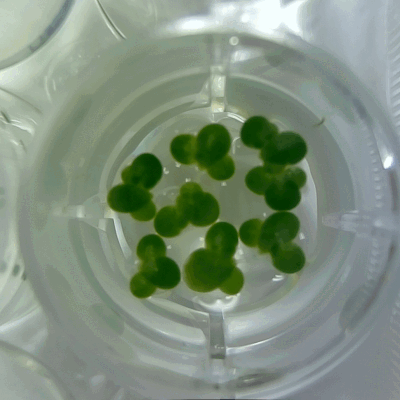

# 🔬🧪 Science Jubilee ⚡⚙️

Welcome to the Science Jubilee docs! This website contains information for lab automation using [Jubilee](https://jubilee3d.com/index.php?title=Main_Page). To get started, check out our guides:

```{eval-rst}
.. grid:: 1 2 2 2
    :gutter: 4
    :padding: 2 2 0 0
    :class-container: sd-text-center

    .. grid-item-card:: Getting Started
        :class-card: intro-card
        :shadow: md

        The getting started guides help you start using ``science-jubilee`` to control your machine, including installation, examples, and introduction to key concepts.

        +++

        .. button-ref:: getting-started
            :ref-type: ref
            :click-parent:
            :color: secondary
            :expand:

            Getting Started Guides

    .. grid-item-card:: Building a Science Jubilee
        :class-card: intro-card
        :shadow: md

        The build guides contain information to build existing tools for use on your Science Jubilee, as well as resources to assemble the Jubilee motion platform itself.

        +++

        .. button-ref:: build-guides
            :ref-type: ref
            :click-parent:
            :color: secondary
            :expand:

            Build Guides

    .. grid-item-card::  API Reference
        :class-card: intro-card
        :shadow: md

        The reference contains a detailed description of
        the API. It assumes that you have an understanding of the key concepts.

        +++

        .. button-link:: autoapi/index.html
            :ref-type: ref
            :click-parent:
            :color: secondary
            :expand:

            Reference

    .. grid-item-card::  Community Contributions
        :class-card: intro-card
        :shadow: md

        Want to add a new tool design or feature? The contributing guides provide information on how you can help improve and expand ``science-jubilee``.

        +++

        .. button-ref:: development
            :ref-type: ref
            :click-parent:
            :color: secondary
            :expand:

            Contributing Guides
```

## What is a Science Jubilee?

[Jubilee](https://jubilee3d.com/index.php?title=Main_Page) is an open-source & extensible multi-tool motion platform. If that doesn't mean much to you, you can think of it as a 3D printer that can change its tools. `science-jubilee` provides tools and associated control software to use Jubilee for laboratory automation. This website contains documentation for various lab automation applications including liquid handling, imaging, and sample manipulation. While these applications might cater exactly to your planned use case, they most likely will not! `science-jubilee` is meant to be flexible; hopefully, the examples here provide a foundation for you to design all sorts of niche experiments.

<!-- |           pipetting        |         duckweed         |
|:--------------------------:|:------------------------:|
|  |  | -->

<table>
    <thead>
        <tr>
            <th style="padding-right: 10px;">Pipetting</th>
            <th style="padding-left: 10px;">Duckweed</th>
        </tr>
    </thead>
    <tbody>
        <tr>
            <td style="padding-right: 10px;">
                
            </td>
            <td style="padding-left: 10px;">
                
            </td>
        </tr>
    </tbody>
</table>

<br>

Jubilee is used in various scientific contexts. A few examples include:

- [The Duckbot](https://github.com/machineagency/duckbot), for automating duckweed experiments
- [Sonication Station](https://github.com/machineagency/sonication_station/), for sonicating samples
- [Jubiris](https://github.com/bunnie/jubiris/tree/main), for Infra-Red, In-Situ (IRIS) inspection of silicon

We hope that `science-jubilee` helps you add to this list--if you're using Jubilee for lab automation, reach out to be added here!

## Join the Community!

- Whether you've built a Jubilee or are just interested in what sorts of things other people are up to, we encourage you to [join the Jubilee Builders & Extenders Discord](https://discord.gg/RxMaGJdGH9)! There's a large community of Jubilee builders doing all sorts of things there; you might be particularly interested in the `#lab-automation` channel.
- For a more focused discussion, you can also join our [Open Source Lab Automation Discord](https://discord.com/invite/j9Bqv3djvN)!

:::{toctree}
:maxdepth: 5
:hidden:

getting_started/index
building/index
development/index
:::
