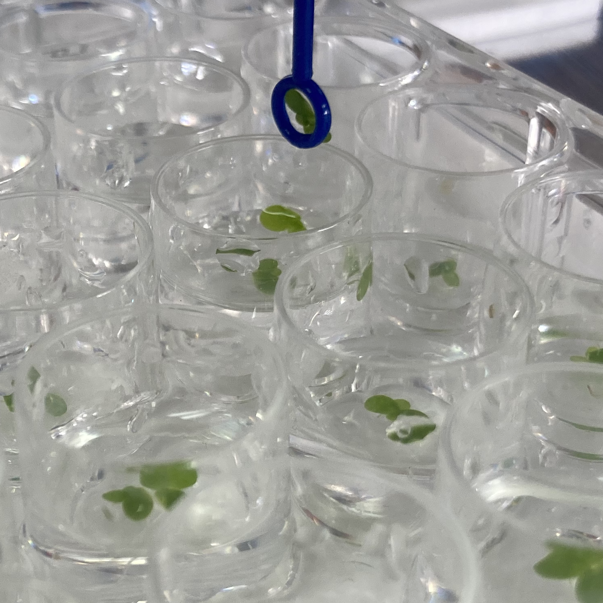

.. _inoculation_tool:

*********************
Inoculation Loop Tool
*********************

Last Edited: Blair, 2023.11.11

    
    Inoculation loop dipping into a well to pick up duckweed fronds.

The inoculation loop tool uses the existing `pen tool <https://jubilee3d.com/index.php?title=Passive_Pen_Tool>`_ to hold an inoculation loop or other probes.

Parts to Buy
============
* Inoculation loop

Parts to 3D Print
=================
* Beyond the pen tool parts documented at the Jubilee project page, we have a customizable inoculation loop `design <https://www.thingiverse.com/thing:5523037>`_ to move heavy duckweed fronds. 
