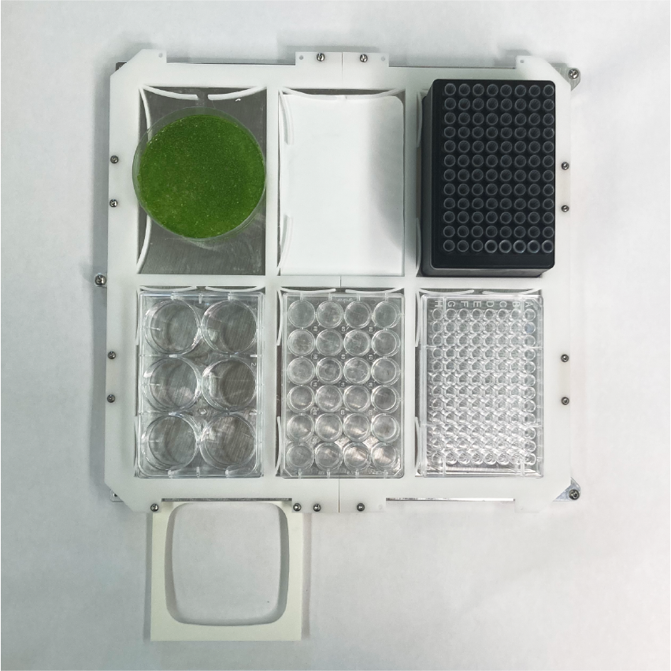

.. _deck_guide:

****************************
Lab Automation Deck Tutorial
****************************

Last Edited: Blair, 2023.11.13

This guide walks you through the basics of using a lab automation deck in conjunction with labware. It assumes you have a lab automation deck installed on your machine.

Creating a Deck Definition
===========================

The standard lab automation deck consists of 6 slots (indices 0-5), and a number of optional garbage containers which can be positioned outside of the deck footprint:

    
    A lab automation deck holding a 6-, 24-, and 96-well plate as well as a pipette tip rack and petri dish of duckweed. The 3D printed frame off the bed houses a sharps container.

.. figure:: _static/deck_layout.png
    :scale: 50 %
    :alt: deck layout.
    
    Orientation of slots on deck and labware in slots.

To use the lab automation deck, we need to set the offsets for each of the 6 slots, as well as any off-deck containers, and place the definition in the ``decks/deck_definitions/`` directory. The preferred method to do so accurately is with a camera tool; the `deck definition calibration notebook <https://github.com/machineagency/science_jubilee/blob/main/science_jubilee/calibration/LabAutomationDeckCalibration.ipynb>`_ interactively guides you through this process. If you do not have a camera tool, this can also be done using any other tool that extends into the build volume such that you can accurately align the tool tip to a corner of each slot.

Creating Labware Definitions
============================

Each piece of labware requires a labware definition in ``labware/labware_definitions``. This file contains accurate measurements and information about the dimensions, well positions, and more for your labware. Our format is identical to the `OpenTrons labware definitions <https://support.opentrons.com/s/article/What-is-a-labware-definition>`_. If you have used an OpenTrons before, this means you can use any existing labware definitions you have with Jubilee. It also means you can use the Opentrons `Labware Designer <https://labware.opentrons.com/create/>`_ to create custom definitions.

In general, labware is saved in the format ``<brand>_<number_of_wells>_<labware_type>_<well_volume>_<extra_identifiers>.json``. For example, a Corning 96 well plate has the name ``corning_96_wellplate_360ul_flat.json``; an OpenTrons pipette tip rack is named ``opentrons_96_tiprack_300ul.json``. We recommend following this convention for specificity and for sharing experimental workflows.  

Using a Lab Automation Deck + Labware
=====================================

We can use our deck + labware definitions in code. First, we need to import relevant modules:: 

  from science_jubilee.Machine import Machine
  from science_jubilee.Decks import Deck

We can then load a deck onto the machine, and labware into the deck:: 

  m = Machine()
  deck = m.load_deck("<my_deck_definition>")
  labware = deck.load_labware("<my_labware_defintion>")
  

Note that we can omit the ``.json`` file extension. Let's take an example using a 24-well plate. Each labware is made up of a numbe of ``Well`` objects. We can access information like size and location of each well by its row-column identification (A1, A2, ...) or its index (0, 1, ...), where index 0 corresponds to A1:: 

  labware = deck.load_labware("greiner_24_wellplate_3300ul", 1)
  well = labware["A1"] # Identical to labware[0]

The value of ``well`` for this labware is:: 

  Well(name='A1', depth=16.5, totalLiquidVolume=3300, shape='circular', 
      diameter=16.28, xDimension=None, yDimension=None, x=175.13, 
      y=79.3, z=2.5, offset=[160.0, 7.3])

The value of ``offset`` comes from your specific automation deck calibration, and is used to adjust the position of each well. All other information derives from your labware definition. We can access each attribute directly:: 

  well.x      # 175.13, the x position of the well center
  well.y      # 79.3,   the y position of the well center
  well.depth  # 16.5,   the usable depth of this well from the top of the labware
  well.z      # 7.5,    the thickness of the labware plate

